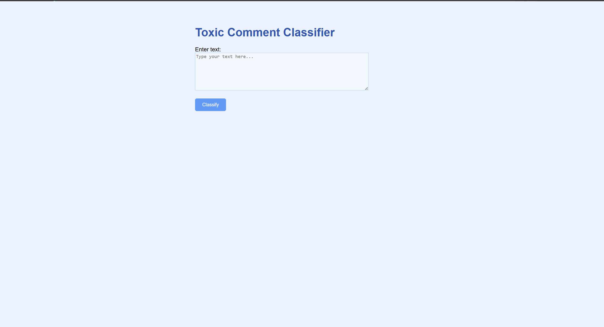

# A7-Training-Distillation-vs-LoRA

## Author Info
- **Name**: WIN MYINT@HTET WAI YAN HTUT (WILLIAM)  
- **Student ID**: st125326  
---

## Task 1. Toxic Comment Dataset (1 Point)
**Dataset**: `cardiffnlp/tweet_eval`  
- **Source**: [Hugging Face Datasets](https://huggingface.co/datasets/cardiffnlp/tweet_eval)  
- **Task**: Binary classification (`hate` vs `non-hate`).  
- **Preprocessing**:  
  - Loaded using `datasets.load_dataset("cardiffnlp/tweet_eval", "hate")
  - Tokenized with `bert-base-uncased` tokenizer (max length: 128).  
  - Split into train/validation/test sets.  
---

## Task 2. Odd Layer vs Even Layer Training (2 Points)
### Implementation Details
- **Teacher Model**: `bert-base-uncased` (12 layers).  
- **Student Models**:  
  1. **Odd Layers**: Distilled layers `{1, 3, 5, 7, 9, 11}`
  2. **Even Layers**: Distilled layers `{2, 4, 6, 8, 10, 12}` 
- **Training**:  
  - 5 epochs with learning rate `5e-5`.  
  - Batch size: 64.  
---

## Task 3. LoRA Implementation (1 Point)
**Configuration**:  
- Applied LoRA to BERT’s **query** and **value** attention layers.  
- **Parameters**: Rank `r=16`, alpha `lora_alpha=32`, dropout `0.1`.  
- **Training**:  
  - 5 epochs with learning rate `5e-5`.   
  - Batch size: 64. 
---

## Task 4. Evaluation and Analysis (1 Point)
### Results
| Model Type | Test Loss | Accuracy | F1-Score |
|------------|-----------|----------|----------|
| Odd Layer  | 2.7225    | 52.32%   | 0.63     |
| Even Layer | 2.2576    | 51.14%   | 0.63     |
| LoRA       | 0.8840    | 53.77%   | 0.63     |

### Key Observations
1. **LoRA** achieved the **lowest test loss** and slightly higher accuracy, suggesting better generalization. Hence, the best model out of the three. This aligns with my expectation as LoRA fine-tunes the base model directly without discarding layers, preserving more information.
2. **Odd Layer** performed marginally better than **Even Layer**, possibly due to richer features present in odd-indexed layers.  

### Challenges & Solutions
- **Distillation**:  
  - Challenge: Layer alignment complexity (e.g., mapping teacher layers {1,3,5,...} to student layers {1,2,3,...}) and dimension mismatches
  - Solution: Adjusted layer indexing logic in initialize_student_model() to ensure compatibility.
- **LoRA**:  
  - Challenge: Tuning hyperparameters (rank r, alpha) required extensive experimentation. While LoRA reduces trainable parameters, selecting optimal values for r=16 and alpha=32 was time-consuming.
---

## Task 5. Web Application (1 Point)

How to run the web app
1. Pull the github repository
2. Run python app/app.py
3. Access the app using http://127.0.0.1:5000

## How to use website
1. Open a web browser and navigate to http://127.0.0.1:5000.
2. Enter a sentence in the text field.
3. Click "Classify" button,
4. The response of the toxicity classifier model will be displayed on the screen.

## Screenshot of my web app

